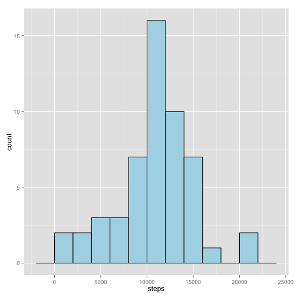
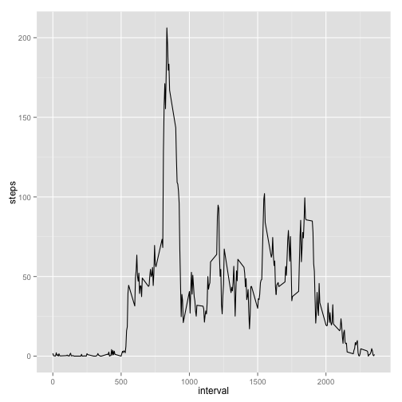
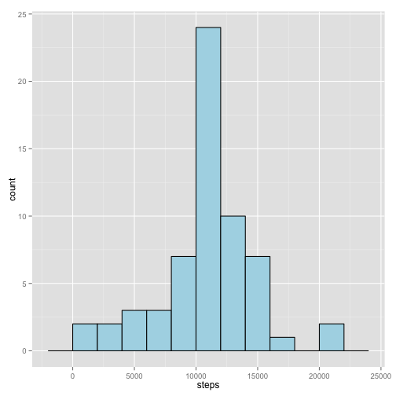
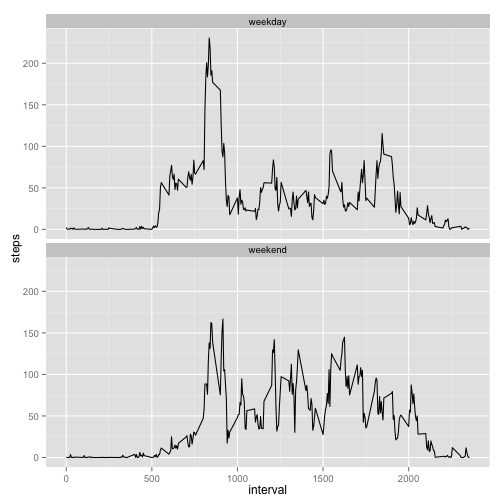

#### Preparation 

* Fork R.Peng github project: https://github.com/rdpeng/RepData_PeerAssessment1
* Clone it to your local computer
* set working directory to the toplevel folder  
  e.g. setwd("/Users/pknuesel/coursera-reproducible")

#### used libraries

```r
library(ggplot2)
```

## Loading and preprocessing the data

1. Load the data (i.e. read.csv())
2. Process/transform the data (if necessary) into a format suitable for your analysis


```r
act <- read.csv(unzip("activity.zip", "activity.csv"), 
                header=TRUE, 
                sep=",",
                colClasses=c("integer", "Date", "integer")
                )
```

## What is mean total number of steps taken per day?

For this part of the assignment, you can ignore the missing values in the 
dataset.


```r
act.complete <- na.omit(act)
nrow(act) - nrow(act.complete)
```

```
## [1] 2304
```

1. Calculate the total number of steps taken per day


```r
steps.day <- aggregate(steps ~ date, data=act.complete, FUN=sum)
```

2. If you do not understand the difference between a histogram and a barplot, 
   research the difference between them. Make a histogram of the total number of
   steps taken each day


```r
ggplot(steps.day, 
       aes(x=steps)) + 
       geom_histogram(binwidth=2000, colour="black", fill="lightblue")
```

 

3. Calculate and report the mean and median of the total number of steps taken 
   per day


```r
mean(steps.day$steps)
```

```
## [1] 10766.19
```


```r
median(steps.day$steps)
```

```
## [1] 10765
```


## What is the average daily activity pattern?

1. Make a time series plot (i.e. type = "l") of the 5-minute interval (x-axis) 
   and the average number of steps taken, averaged across all days (y-axis)


```r
steps.interval <- aggregate(steps ~ interval, data=act.complete, FUN=mean)

ggplot(steps.interval, aes(x=interval, y=steps)) + 
    geom_line(stat="identity")
```

 

2. Which 5-minute interval, on average across all the days in the dataset, 
   contains the maximum number of steps?


```r
steps.interval$interval[which.max(steps.interval$steps)]
```

```
## [1] 835
```

## Imputing missing values

Note that there are a number of days/intervals where there are missing values 
(coded as NA). The presence of missing days may introduce bias into some 
calculations or summaries of the data.

1. Calculate and report the total number of missing values in the dataset 
   (i.e. the total number of rows with NAs)


```r
length(which(is.na(act$steps)))
```

```
## [1] 2304
```

```r
# same number of records we removed to get act.complete
```

2. Devise a strategy for filling in all of the missing values in the dataset. 
   The strategy does not need to be sophisticated. For example, you could use 
   the mean/median for that day, or the mean for that 5-minute interval, etc.

3. Create a new dataset that is equal to the original dataset but with the missing data filled in.


```r
# we already have the average steps per interval in steps.interval
# use it where act$steps is NA
act.fixed <- merge(
                   act[is.na(act$steps),], 
                   steps.interval, 
                   by= "interval", 
                   all.x=TRUE, 
                   all.y=FALSE
                  )
# remove the steps from x
act.fixed$steps.x <- NULL
# rename the steps from y
colnames(act.fixed)[3] <- "steps"

# there is a complete and a fixed data frame
# combine it to get a full data frame
act.total <- rbind(act.complete, act.fixed)
```

4. Make a histogram of the total number of steps taken each day and Calculate 
   and report the mean and median total number of steps taken per day. 
   Do these values differ from the estimates from the first part of the 
   assignment? What is the impact of imputing missing data on the estimates of 
   the total daily number of steps?


```r
stepstotal.day <- aggregate(steps ~ date, data=act.total, FUN=sum)

ggplot(stepstotal.day, aes(x=steps)) + 
    geom_histogram(binwidth=2000, colour="black", fill="lightblue")
```

 


```r
mean(stepstotal.day$steps)
```

```
## [1] 10766.19
```


```r
median(stepstotal.day$steps)
```

```
## [1] 10766.19
```

The mean has not changed, the median is a bit increased (and is equal to the mean now)


The fix added a total of 86k steps to the dataframe (571k + 86k = 657k steps).

## Are there differences in activity patterns between weekdays and weekends?

For this part the weekdays() function may be of some help here. Use the dataset 
with the filled-in missing values for this part.

1. Create a new factor variable in the dataset with two levels – “weekday” and 
   “weekend” indicating whether a given date is a weekday or weekend day.


```r
# note: local names for days used, but I leave it as it is not shown somwehere
act.total$daytype[weekdays(act.total$date) %in% c("Samstag", "Sonntag")] <- "weekend"
act.total$daytype[!weekdays(act.total$date) %in% c("Samstag", "Sonntag")] <- "weekday"

act.total[, 4] <- as.factor(act.total[, 4])
```

2. Make a panel plot containing a time series plot (i.e. type = "l") of the 
   5-minute interval (x-axis) and the average number of steps taken, averaged 
   across all weekday days or weekend days (y-axis). See the README file in the 
   GitHub repository to see an example of what this plot should look like using 
   simulated data.


```r
stepstotal.interval <- aggregate(steps ~ interval + daytype, data=act.total, FUN=mean)

ggplot(stepstotal.interval, aes(x=interval, y=steps, group=1)) +
    geom_line() + 
    facet_wrap(~ daytype, ncol=1)
```

 

2015-02-15, Philipp
